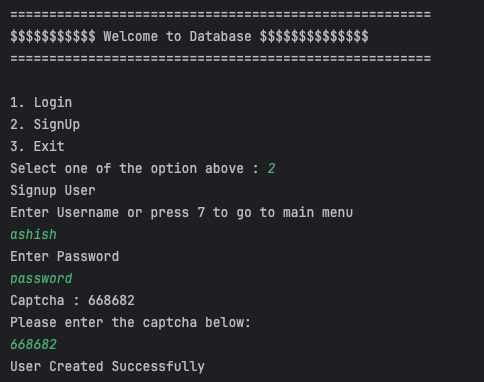
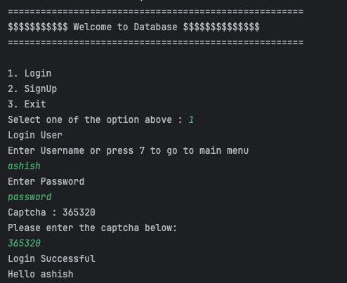
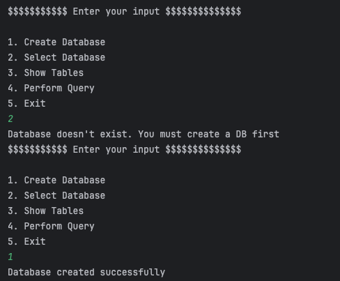
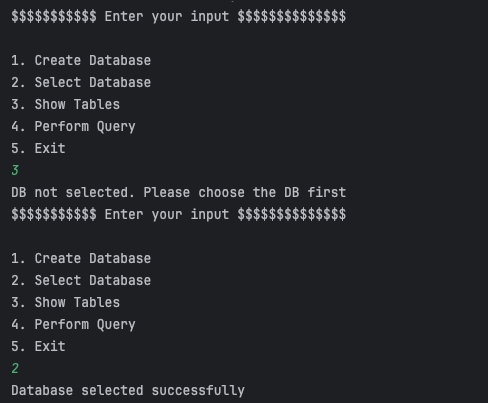
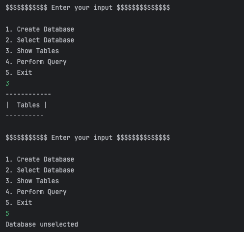
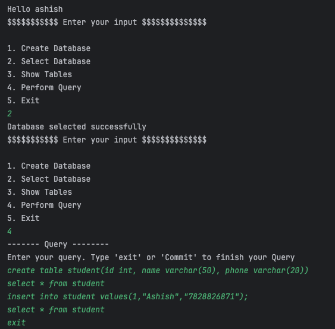
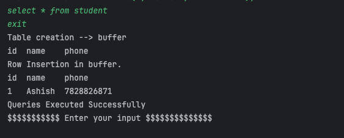
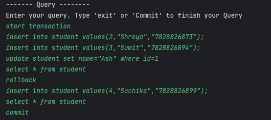
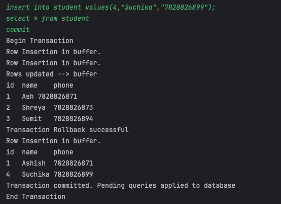

# My-SQL-Lite

# Project Description

### Overview
This Java-based application serves as a lightweight database clone that provides:
- User authentication with two-factor authentication ( Captcha )
- Multi-user support with persistent storage using text files
- CRUD operations
- Transaction management
- SQL-like query processing

### SOLID principles it follows

The application adheres to the following SOLID principles:
- Single Responsibility Principle (S):
    - **_Authentication_**: Manages user login, validation, and password-related operations.

        ```java
        public class Authentication {
        // Methods for user login, validation, and password-related operations
        }
        ```

    - **_DatabaseProcessor_**: Manages different database operations and processes SQL-like commands.

        ``` java
        public class DatabaseProcessor {
        // Methods for managing database operations and executing SQL-like commands
        }
        ```

    - **_QueryProcessor_**: Handles the processing and execution of SQL-like query operations.

        ``` java
        public class QueryProcessor {
        // Methods for processing and executing SQL-like query operations
        }
        ```

    - **_DatabaseUpdate_**: Reads data from files and updates table files accordingly.

        ``` java
        public class DatabaseUpdate {
        // Methods for reading data from files and updating table files
        }
        ```

- Open/Closed Principle (O):

    The design allows for easy extension to add new functionalities.
    ```java
    public class QueryProcessor {
        // Easily extendable methods to add new functionalities
    }
    ```

# Project Requirements

### Motivation of the project
This project was part of my **_Data Warehouse, Analytics and Management_** assignment. Two weeks were given to complete it along with [report](./B00957622_AshishNagpal_A1.pdf) submission.

### What to build ?
1. Prototype of a light-weight DBMS using ``Java`` programming language and Implementation of custom multiuser DBMS with a single Transaction manager application. 
2. Custom-built program written in Java and perform concurrent transactions

### Status achieved ?

I was successfully able to achieve all the requirements of the assignment and secured ``100%``. Moreover, I created database level operations - `Select Database` and `Show Tables` as well as implemented the code such that it can be extended for future scope.

### How did I start ?

To start with the assignment first I researched about storing files using Java programming. Referring to the Oracle documentation[1], I understood the file implementation and locking mechanism to ensure ``ACID`` property for my database. Next, I checked the ``md5`` hasing mechanism and refreshed my concepts of Java, mainly ``HashMaps`` and string methods [4] & [5]. Lastly I verified and refactored my code to follow ``SOLID`` principles.[2].

### Future Scope

- Multi-database - Currently I have restricted user to select only single database. However, I am storing the active database of the user in the file system when the user selects the database. Thereby, there can be multiple database having different tables.

- Graphical/ Web user interface - Instead of console based application, this project can be extended by providing a nice user interface to increase the usability.


# Challenges 

While developing this application, what challenges I encountered and how did I overcome it:

- Implementing **multi-user** support which maps with the database - Initially, I struggled thinking the logic of how to map the user and database. Then, after narrowing down the requirements, I came up with the idea to store it in the file. 

- File-based **persistence** and ensuring **data consistency** during concurrent file accesses - Using lock mechanism was quite challenging, yet an interesting and core part of this project. I referred to Oracle documentation[1] and implemented this.

- **Data separation Delimeter** - Initially, I thought of storing the files in JSON format which has the predefined data separation mechanism. However, defining a custom delimeter had bonus points, thereby I defined my own custom separator present in ``Utils`` file and used that to separate my rows in the text file. 

- Implementing **transaction** management -  After Q&A session with the professor[6] regarding the assignment, they provided the hint to store the queries in the ``buffer`` first and then once commit happens, you should write the actual files.


# Workflow 

For this project I have ensured that every line of the query is executed as transaction irrespective of whether we have mentioned ``Start Transaction``. The concept was taught by the professor[6] during lecture which I used to implement it in my project.  
I have created separate classes for DatabaseProcessing, QueryProcessing as well as DatabaseUpdate for the respective operations.  

Thereby, the execution starts from the ``Main`` class and it calls the ``performQuery`` method of the ``DatabaseProcessor`` class. The performQuery method checks the execution type and verifies if the ``Database`` is created or selected and checks the syntax of the input if it is of type query. If everything is valid, the Transaction begins and the data is updated in buffer.   

By default ( Non transaction queries ) the data is stored in the files or if the user adds the commit at the end of transaction execution.

## Code Understanding

- Execution Start Point:

    The execution of my application starts from the ``Main`` class, which serves as the entry point of the database.

    ```java
    public class Main {
        // Entry point of the application
        public static void main(String[] args) {
        // Code to initiate the database and user authentication
        }
    }
    ```

- User Interaction:

   Upon running the Main class, the user is prompted with an ``authentication`` , where they are required to provide their username and password for login or signup as a new user

    ```java
    public class Authentication {
    // Method to handle user authentication
    public void authenticateUser() {
        // Code to collect user input for username and password
        }
    }
    ```


- Main Menu:

    After successful authentication, the user is presented with a main menu where they can select various database operations such as:

    1. Create Database
    2. Select Database
    3. Show Tables
    4. Perform Query
    5. Exit


    ```java
    public class Main {
        // Method to display main menu and handle user's choice
        
    }
    ```

    The Menu is present in the ``Main`` class and upon option selection the ``performOperation`` method of ``DatabaseProcessor`` class is called.

- Query Execution:

    For executing queries, the user inputs an SQL-like query, which is then processed by the QueryProcessor class.

    ```java
    public class QueryProcessor {
        public void querySelector(String query) {
        // Code to parse and execute the SQL-like query
        }
    }
    ```

- Transaction Management:

    To start a transaction, the user inputs Start transaction, and to commit the transaction, they input commit. If a user wants to rollback a transaction, they need to ensure that the transaction was started using Start transaction and then input rollback.

    ```java
    public class Transaction {
    // Method to handle transaction operations
    public void beginTransaction() {
        // Code to initiate a new transaction
        }

    public void commit() {
        // Code to commit the transaction
        }

    public void endTransaction() {

        }

    public void rollbackTransaction() {
        // Code to rollback the transaction
        }
    }
    ```

- File and Database Update:

    All database and user data are stored in text files using the DatabaseUpdate class. The DatabaseProcessor class manages the creation and selection of databases, while the Users class handles user data storage and retrieval.

    ``` java
    public class DatabaseUpdate {
    // Methods to update database files
    }

    public class DatabaseProcessor {
    // Methods to manage database operations
    }

    public class Users {
    // Methods to manage user data storage and retrieval
    }
    ```


# Run it locally 

### Pre-requisites:

- Java Development Kit (JDK) 8 or higher installed
- Text editor or Integrated Development Environment (IDE) such as IntelliJ IDEA or Eclipse


### Installation Steps:

- Clone the Repository:

    ```bash 
    Https - 
        git clone https://github.com/ashishnagpal2498/my-sql-lite.git

    SSH
        git clone git@github.com:ashishnagpal2498/my-sql-lite.git
    ```

- Navigate to the Project Directory:

    ```bash
    cd my-sql-lite 
    ```

- Running the Application:

    - Compile the Java Files:

        ``` bash
        javac *.java
        ```

    - Run the Main Class:

        ```bash
        java Main
        ```

# Usage:

Upon running the application, you will be prompted to authenticate
Follow the on-screen instructions to perform database operations such as creating, selecting databases, and executing CRUD operations.
- To start a transaction, use the command Start transaction, and to commit the transaction, use commit.

- To rollback a transaction, make sure it was started using Start transaction and then use rollback.

# Test cases

1. Create user, login via user, create database, select database and show tables.
    - We have to create a new user using signup option
    

    - To login through a new user, we have to choose option 1 and then enter the credentials with correct captcha.
    

    - Create a database first. Before that, I have tried to select the database which shows the error that the database doesn’t exist.
    

    - Select the database before performing queries.
    

    - View all tables and exit
    

2. Perform Query - create table, insert data and select values from the table.
    ```sql
    create table student(id int, name varchar(50), phone varchar(20))
    select * from student
    insert into student values(1,"Ashish","7828826871");
    select * from student
    exit
    ```
    - Query Input
    

    - Output Output
    

3. Perform Transaction - insert and update data into student table. View all the contents of the table using the select command. Rollback the previous queries and then insert a new row. Show the current status of the table. Commit the transaction and show data again.
    ```sql
    start transaction
    insert into student values(2,"Shreya","7828826873");
    insert into student values(3,"Sumit","7828826894");
    update student set name="Ash" where id=1
    select * from student
    rollback
    insert into student values(4,"Suchika","7828826899");
    select * from student
    commit
    ```
    - Query Input
    

    - Output Output
    

# References
1. Oracle, "Methods for Channels and ByteBuffers," Oracle Java SE Documentation, [Online]. Available: https://docs.oracle.com/javase/tutorial/essential/io/file.html#channels. [Accessed: October 23, 2023].

2. BMC, "The Importance of SOLID Design Principles," BMC Blogs, [Online], June 15, 2020 Available: https://www.bmc.com/blogs/solid-design-principles/. [Accessed: November 03, 2023].

3. Baeldung, "MD5 Hashing in Java," Baeldung, [Online], January 9, 2021 Available: https://www.baeldung.com/java-md5. [Accessed: October 23, 2023].

4. GeeksforGeeks, "HashMap in Java," GeeksforGeeks, [Online], September 6, 2023 Available: https://www.geeksforgeeks.org/java-util-hashmap-in-java-with-examples/. [Accessed: October 20, 2023].

5. GeeksforGeeks, "Split() String method in Java with examples," GeeksforGeeks, [Online], September 6, 2023 Available: https://www.geeksforgeeks.org/split-string-java-examples/. [Accessed: October 23, 2023].

6. S. Dey (October 5, 2023), “SQL statements of the transaction,”Room 5260, Department of Psychology, Dalhousie University. [PowerPoint slides available: https://dal.brightspace.com/d2l/le/content/284056/viewContent/3904477/View]


